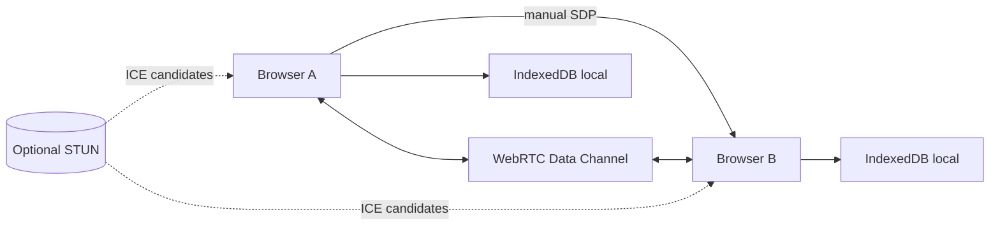

# Orabit Architecture

## تدفق الاتصال

GitHub Pages يرسل HTML/CSS/JavaScript فقط. لا يستقبل رسائل المحادثة.

## تدفق الرسالة

1. ينشئ الطرفان مفتاح ECDH مؤقتًا.
2. يشتق الطرفان سرًا مشتركًا عبر ECDH ثم مفتاحي AES وHMAC عبر HKDF.
3. تُشفّر الرسالة بمفتاح AES-256-GCM وIV عشوائي لكل رسالة.
4. يُحسب HMAC على `IV || ciphertext` كطبقة تحقق إضافية.
5. تُرسل حزمة JSON عبر Data Channel.
6. يتحقق المستقبل من HMAC ثم يفك AES-GCM.

تجديد مفاتيح ECDH ينبغي تفعيله في الإصدار الإنتاجي وفق Ratchet دوري. مفتاح جلسة واحد ليس Forward Secrecy كاملة؛ الكود الحالي يضع أساسًا قابلًا للتوسعة ويولد مفاتيح مؤقتة لكل اتصال.

## نقل الملفات والصوت

تحول الرسائل الصوتية إلى Blob ثم ArrayBuffer وتشفّر كنص Base64 داخل AES-GCM. الملفات تقسم إلى أجزاء 16KB مع رسالة بداية ونهاية، ويعيد المستقبل بناء Blob في الذاكرة. لا يحفظ الملف تلقائيًا؛ يظهر كرابط تنزيل عند استلامه.
